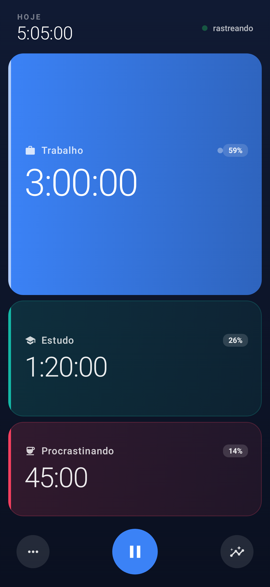
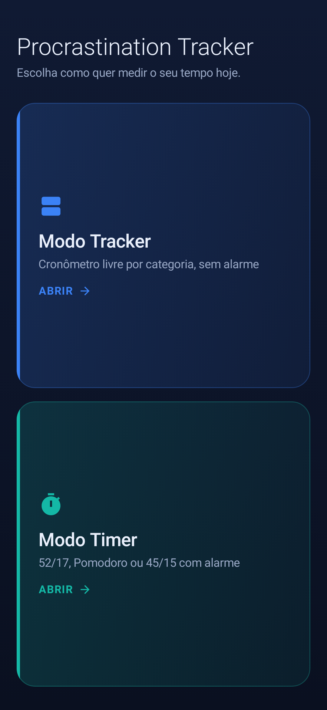
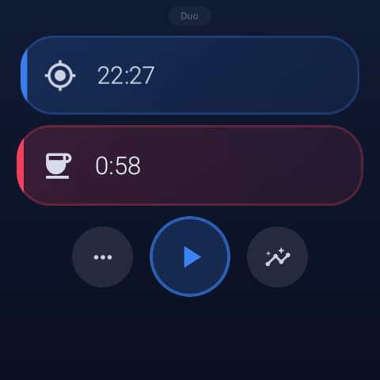
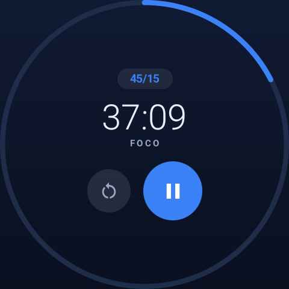
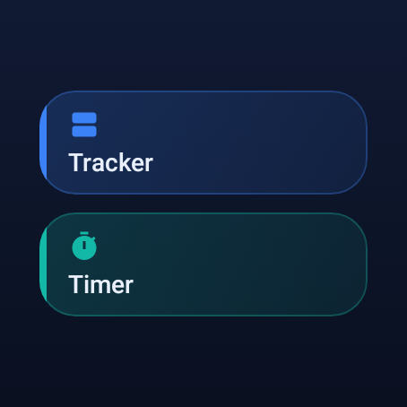

<div align="center">

# Procrastination Tracker

**Saiba para onde seu tempo realmente vai — no celular e no pulso.**

Um rastreador de tempo com dois modos, para Android e Wear OS: o clássico timer de foco 52/17 e
Pomodoro, mais um cronômetro livre por categoria para quem tem um dia que não cabe num ciclo fixo.

[](https://github.com/otaciliofox/procrastination-tracker/actions/workflows/ci.yml)
[](https://github.com/otaciliofox/procrastination-tracker/releases/latest)
[](https://kotlinlang.org)
[](https://developer.android.com/jetpack/compose)
[](https://wearos.google.com)
[-3DDC84?logo=android&logoColor=white)](https://developer.android.com)
[](https://developer.android.com/training/data-storage/room)
[](https://gradle.org)
[](LICENSE)

[English](README.md) · [Arquitetura](docs/ARCHITECTURE.md) · [Testes](docs/TESTING.md) · [Roadmap](docs/ROADMAP.md)

<table>
<tr>
<td align="center"></td>
<td align="center"></td>
</tr>
<tr>
<td align="center"><b>Modo Tracker</b><br>a altura de cada faixa é a fatia dela no dia</td>
<td align="center"><b>Início</b><br>escolha como quer medir o seu tempo</td>
</tr>
</table>

<table>
<tr>
<td align="center"></td>
<td align="center"></td>
<td align="center"></td>
</tr>
<tr>
<td align="center"><b>Tracker</b><br>as faixas viram uma lista com escala</td>
<td align="center"><b>Timer</b><br>o progresso do bloco como anel</td>
<td align="center"><b>Início</b><br>os dois modos, no tamanho do círculo</td>
</tr>
</table>

<sub>As telas do celular e o início do relógio são gerados pelos testes de screenshot do Compose, então não têm como ficar desatualizados. As duas telas do relógio em uso foram capturadas de um Galaxy Watch6.</sub>

</div>

---

## Por que este projeto existe

O **Procrastination Timer** original (`com.tomuozawa.procrastinationtimer`) foi removido da Play
Store — não recebia atualização desde 2019 e deixou de atender aos requisitos de target API. A ideia
dele era simples e funcionava: medir o tempo focado contra o tempo procrastinado e deixar o
contraste falar por si.

Este projeto reconstrói o app para o Android moderno, adiciona uma versão nativa para Galaxy Watch e
o estende com um segundo modo, para os dias que não se dividem direitinho entre "foco" e "pausa".

## Os dois modos

### ⏱️ Modo Timer — o original, reconstruído

Cronometragem por intervalos com notificação persistente, histórico completo de sessões e a
comparação produtivo vs. procrastinado, de hoje e de todo o período.

| Modo | Foco | Pausa curta | Pausa longa |
|---|---|---|---|
| **52/17** | 52 min | 17 min | — |
| **Pomodoro** | 25 min | 5 min | 30 min a cada 4 ciclos |
| **45/15** | 45 min | 15 min | — |
| **Custom** | 1–180 min | 1–180 min | configurável, a cada 2–12 ciclos |

### 🍕 Modo Tracker — um cronômetro por categoria

Uma "pizza" de 2 a 6 fatias com nome livre — Trabalho, Estudo, Treino, Hobby, Procrastinando, o que
fizer sentido. Toque numa fatia para começar a contar, toque de novo para pausar, troque à vontade o
dia inteiro. Sem alarme, sem ritmo imposto.

- **Perfis de layout** — `Duo` e `Tri` vêm prontos e nunca são sobrescritos; editar um deles cria um
  novo perfil Custom. Até 10 perfis Custom, de 2 a 6 fatias cada.
- **Roda em segundo plano** com notificação persistente e ações de Pausar e Parar. Ir para outro app
  não interrompe o tracking; remover o app dos recentes salva o tempo e encerra a sessão.
- **Bloco nas configurações rápidas** e **bolha flutuante** para controlar a fatia ativa sem abrir o
  app.
- **Resumos de hoje e da semana** por fatia, com detalhamento de qual aparelho registrou o tempo.
- **Bloquear a tela agora** — uma ação opcional de acessibilidade para quando o próprio celular é a
  distração.

## Sincronização celular ↔ relógio

Cada app mantém seu próprio banco local completo e funciona 100% offline. Quando os aparelhos estão
por perto, eles se reconciliam **nos dois sentidos** pela Wearable Data Layer API — comece uma
sessão no relógio, termine no celular, e o histórico continua consistente dos dois lados. Um canal
de presença ao vivo alimenta as perguntas de hand-off quando os dois aparelhos estão contando ao
mesmo tempo.

Exclusões viajam como tombstones, então uma sessão apagada num aparelho continua apagada em vez de
voltar na próxima sincronização.

## A arquitetura em resumo

Quatro módulos, com dependências apontando em uma direção só:

```
:app (celular) ─┐
                ├─▶ :trackerdata (Room + sync) ─▶ :core (Kotlin puro)
:wear (relógio) ┘
```

O `:core` guarda a lógica do timer **sem nenhuma dependência de Android**, então celular e relógio
não têm como divergir — e a lógica pode ser testada na JVM, sem emulador. Os dois apps seguem MVVM
com estado unidirecional: o Compose renderiza um `UiState` imutável, os ViewModels o expõem como
`StateFlow`, e os repositórios detêm todo o acesso a dados.

O raciocínio completo está em [docs/ARCHITECTURE.md](docs/ARCHITECTURE.md).

## Tecnologias

**Kotlin** · **Jetpack Compose** + **Material 3** · **Compose for Wear OS** · **Room** ·
**Coroutines & Flow** · **Navigation Compose** · **Foreground Services** · **Quick Settings Tile** ·
**Hilt** · **Wearable Data Layer API** · **Gradle 9.7** com **AGP 9.3.1** e **KSP**

## Testes

Todos os testes automatizados rodam na JVM — sem emulador, sem aparelho conectado — então a suíte
inteira é um comando só e cabe num pipeline:

```bash
./gradlew :core:test :trackerdata:testDebugUnitTest :app:testDebugUnitTest :wear:testDebugUnitTest
```

| Camada | O que cobre |
|---|---|
| **Unitário** (`:core`) | A máquina de estados do timer. O tempo é parâmetro, então um Pomodoro de 4 ciclos roda em microssegundos em vez de 150 minutos |
| **Integração** (`:trackerdata`) | O payload de sync do relógio aplicado num banco Room real em memória: tombstones, última escrita vence, remerge idempotente |
| **ViewModel** (`:app`) | Estado de tela construído a partir de um repositório real, sem app rodando — o que a injeção por construtor destravou |
| **UI** (`:app`, `:wear`) | Telas Compose reais renderizadas, tocadas e fotografadas, o relógio em tela redonda — os prints acima saem desses testes |

O que realmente exige hardware — o foreground service sobreviver, as ações da notificação, o tile,
e a entrega da Data Layer entre dois aparelhos — é verificado à mão, e não por uma suíte de
emulador. O raciocínio está em [docs/TESTING.md](docs/TESTING.md).

## Download

Os APKs assinados dos dois apps ficam anexados a cada release:

**[⬇ Última versão](https://github.com/otaciliofox/procrastination-tracker/releases/latest)** —
`…-phone.apk` e `…-watch.apk`

Instale o APK do celular no celular e o do relógio no relógio. Os dois são assinados com a mesma
chave, que é o que a Wearable Data Layer exige antes de sincronizar qualquer coisa entre eles — um
release cujos dois APKs divirjam na chave é reprovado pelo CI exatamente por isso.

## Como compilar

**Requisitos:** Android Studio Koala (2024.1) ou mais recente, JDK 17+, e um aparelho com Android
8.0 (API 26) ou superior. O app do relógio exige Wear OS 3+ (Galaxy Watch 4 ou mais novo).

```bash
git clone https://github.com/otaciliofox/procrastination-tracker.git
cd procrastination-tracker
./gradlew assembleDebug
```

Isso gera os dois APKs:

- `app/build/outputs/apk/debug/app-debug.apk` — celular
- `wear/build/outputs/apk/debug/wear-debug.apk` — relógio

### Instalando

```bash
adb install app/build/outputs/apk/debug/app-debug.apk
```

No relógio, ative **Configurações → Sobre → toque 5x na versão do software**, depois
**Configurações → Opções do desenvolvedor → Depuração ADB** e **Depurar via Wi-Fi**. O relógio mostra
um IP e uma porta:

```bash
adb connect 192.168.0.42:5555
adb -s 192.168.0.42:5555 install wear/build/outputs/apk/debug/wear-debug.apk
```

Os dois apps são standalone — o relógio não precisa do app do celular aberto.

> **Atenção:** os dois apps precisam ser assinados com a mesma chave para a sincronização funcionar.
> Builds de debug compartilham o keystore de debug, então isso é automático durante o
> desenvolvimento.

## Estrutura do projeto

```
procrastination-tracker/
├── core/         → lógica do timer em Kotlin puro, sem dependência de Android
├── trackerdata/  → banco Room, repositório e codec de sync compartilhados pelos dois apps
├── app/          → app de celular (Jetpack Compose + Material 3)
├── wear/         → app do Galaxy Watch (Compose for Wear OS, standalone)
├── docs/         → arquitetura, roadmap e guias de desenvolvimento
└── spec/         → especificações de funcionalidades
```

## Roadmap

Testes automatizados lideram o backlog, seguidos por injeção de dependência, version catalog e CI.
As funcionalidades novas — tile do Wear OS, complicação no mostrador, gráficos de histórico — vêm
depois. A lista completa está em [docs/ROADMAP.md](docs/ROADMAP.md), incluindo um relato honesto do
que ainda falta no código.

## Licença

[MIT](LICENSE) © Otacílio Neto
